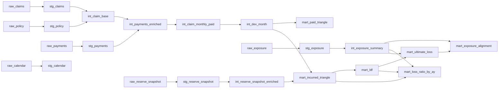

🏦 Développement des Sinistres — Pipeline dbt + Databricks
Un pipeline de données de niveau production pour le provisionnement actuariel, construit avec dbt et Databricks.
Il transforme des données brutes d'assurance en triangles de développement, facteurs de développement (LDF) et estimations de sinistres ultimes — les sorties fondamentales des workflows de provisionnement IFRS 17.

> **Partie 2 d'une série de 3 projets** construisant une plateforme de données actuarielles IFRS 17.  
> → **Small :** [Insurance Policy Admin Mart — Structure du portefeuille & KPI](https://github.com/SHLee5864/insurance_policy_admin_mart)  
> → **Large :** Plateforme IFRS 17 sur Azure

🎯 Objectif du projet
Les assureurs doivent estimer le montant qu'ils paieront in fine sur les sinistres encore ouverts — c'est le développement des sinistres. Ce pipeline automatise cette estimation en :

Ingérant les données brutes de polices, sinistres, paiements et provisions
Construisant un axe Sinistre × Mois de valorisation pour suivre les paiements cumulés dans le temps
Calculant les facteurs de développement (LDF) par la méthode chain ladder pondérée par les volumes
Projetant le sinistre ultime en appliquant les LDF cumulés aux montants déclarés les plus récents
Calculant les ratios sinistres/primes par année d'accident et par région


📐 Architecture
RAW (seed/CSV) → STG (vue) → INT (table) → MART (table)
CoucheMatérialisationRôleRAWseedDonnées CSV synthétiques générées en Python. Aucune transformation.STGvueTranstypage, renommage des colonnes, clés de substitution, tests de qualité de baseINTtableReconstruction par axes AY · Mois de développement · Valorisation. Création de l'axe temporel. Préparation des entrées du triangle.MARTtableTriangle, LDF, Sinistre ultime, Ratio sinistres/primes — prêts pour l'analyse actuarielle

Pourquoi table pour INT ? int_claim_monthly_paid génère un axe Sinistre × Mois de valorisation dont le volume de lignes croît exponentiellement. L'utilisation de ephemeral intégrerait ce calcul comme CTE imbriqué et risquerait de faire exploser le plan d'exécution dans Databricks. La matérialisation en table est un choix délibéré.


🗂 Lignage des modèles


> Full lineage from dbt docs:


📊 Modèles MART
| Modèle                   | Description                                                                |
|--------------------------|----------------------------------------------------------------------------|
| mart_paid_triangle       | Triangle des paiements cumulés par AY × Mois de développement              |
| mart_incurred_triangle   | Triangle des sinistres déclarés (payé + provision) au grain                |
|                          | AY × Année de développement. dev_year = valuation_year - accident_year + 1 |
| mart_ldf                 | LDF moyen et LDF cumulé par année de développement (méthode chain ladder)  |
| mart_ultimate_loss       | Sinistre ultime = dernier incurred × LDF cumulé par année d'accident.      |
|                          | Les années pleinement développées ont un LDF cumulé par défaut de 1.0      |
| mart_loss_ratio_by_ay    | Évolution du ratio S/P par AY × Année de valorisation.                     |
|                          | Montre comment l'estimation du sinistre ultime mûrit dans le temps         |
| mart_exposure_alignment  | Exposition acquise et prime alignées par AY × Région                       |

🔢 Calcul du LDF
LDF moyen par année de développement (chain ladder) :

  LDF(d) = AVG(incurred[d+1] / incurred[d])   -- moyenné sur toutes les AY
  LDF cumulé = EXP(SUM(LN(ldf))) OVER (ORDER BY dev_year_from DESC)

L'année de développement (dev_year) = valuation_year - accident_year + 1.
Cet alignement permet une comparaison homogène de toutes les années d'accident
sur le même axe de développement, indépendamment de la date du sinistre.

Le LDF cumulé représente le facteur de développement restant jusqu'à l'ultime.
Les années d'accident pleinement développées (sans paire LDF) ont un
LDF cumulé par défaut de 1.0 via COALESCE.

📅 Effets macro-économiques du calendrier
Le pipeline modélise les chocs macro-économiques réels affectant la fréquence et la sévérité des sinistres :
IndicateurEffetis_covid_waveRéduit la fréquence des sinistres (effet confinement)is_weather_eventAugmente la sévérité des paiementstravel_boomAugmente la fréquence des sinistresmacro_inflation_factorAjuste les montants de paiement dans le temps

⚠️ Conception des tests de qualité
Les tests sont classés par sévérité :

ERROR : Défauts structurels (clés nulles, relations cassées, grain en doublon) — le pipeline s'arrête
WARN : Anomalies métier valides en pratique (ex. paiements négatifs issus de remboursements ou d'extournes)

Les montants de paiement négatifs sont conservés intentionnellement dans les données de seed et signalés en WARN — conformément aux scénarios réels où les extournes de sinistres produisent des valeurs négatives.

⚙️ Démarrage rapide (DuckDB — développement local)
```bash
# 1. Créer l'environnement virtuel
python -m venv venv
venv\Scripts\activate          # Windows
source venv/bin/activate       # Mac/Linux

# 2. Installer les dépendances
pip install dbt-duckdb dbt-utils

# 3. Correction de l'encodage (Windows uniquement)
$env:PYTHONUTF8 = "1"

# 4. Installer les packages dbt
dbt deps

# 5. Charger les données seed
dbt seed

# 6. Exécuter tous les modèles
dbt run

# 7. Lancer les tests
dbt test
```

🔌 Connexion Databricks (profiles.yml)
yamlinsurance_claims_loss_development_dbt:
  target: prod
  outputs:
    prod:
      type: databricks
      host: <votre-workspace>.cloud.databricks.com
      http_path: /sql/1.0/warehouses/<warehouse-id>
      token: "{{ env_var('DBT_DATABRICKS_TOKEN') }}"
      catalog: <votre-catalog>
      schema: insurance_dbt
      threads: 4

profiles.yml se trouve dans ~/.dbt/ et n'est jamais versionné dans le dépôt.

Validé sur : Databricks SQL Warehouse (Serverless), dbt-databricks 1.11.6

🧱 Simplifications vs. production réelle

| Ce projet | Réalité en production |
|---|---|
| Données synthétiques générées en Python | Données issues des systèmes de gestion de sinistres (Guidewire, Duck Creek) |
| Chain ladder SQL monoposte | Méthode de Mack avec écart-type et intervalles de confiance |
| LDF moyen simple | LDF pondéré par les volumes ou méthode Bornhuetter-Ferguson |
| Indicateurs macro statiques | Flux macro en temps réel (IPC, APIs météo) |
| Sans CI/CD | GitHub Actions → dbt test sur PR → job Databricks au merge |
| DuckDB en local | Delta Lake sur ADLS Gen2 / S3 |
| Provision : modèle par courbe d'apprentissage | Jugement actuariel + modèles stochastiques de provisionnement |
| Prime annuelle ~20k€ (flotte/corp.) | Mix de portefeuilles individuels et commerciaux |
| Distribution normale (sévérité) | Log-normale — toujours positive, asymétrie droite, reflétant les sinistres importants occasionnels |
| Distribution normale (provision) | Log-normale — standard actuariel pour l'estimation des provisions individuelles |
| Taux de base 2% (fréquence) | Taux de base 5% — plus proche des benchmarks sectoriels en assurance automobile |

📦 Stack technique

dbt-core ≥ 1.7
dbt-duckdb (développement local) / dbt-databricks (production)
dbt-utils — clés de substitution, tests génériques
Python 3.10+ — génération de données synthétiques
Databricks SQL Warehouse (Serverless)

**Sukhee Lee** — Analyste Données Actuarielles | IFRS 17 · dbt · Databricks  
Alliance entre expertise actuarielle (CSM IFRS 17, provisionnement, modélisation AXA)  
et pratiques modernes d'ingénierie des données pour construire des pipelines  
reproductibles et auditables dédiés au provisionnement assurance et au reporting réglementaire.