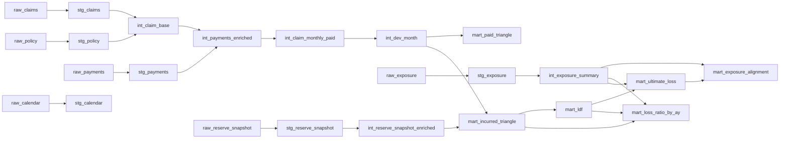
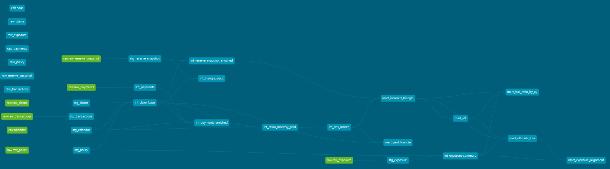

🏦 Insurance Claims Loss Development — dbt + Databricks
A production-grade data pipeline for actuarial loss reserving, built with dbt and Databricks.
Transforms raw insurance claims data into Loss Development Triangles, LDFs, and Ultimate Loss estimates — the core outputs used in IFRS 17 reserving workflows.

> **Part 2 of a 3-project series** building toward a full IFRS 17 actuarial data platform.  
> → **Small:** [Insurance Policy Admin Mart — Portfolio Structure & KPIs](https://github.com/SHLee5864/insurance_policy_admin_mart)  
> → **Large:** IFRS 17 Analytics Platform on Azure

🎯 What This Project Does
Insurance companies must estimate how much they will ultimately pay on claims that are still open — a process called loss development. This pipeline automates that estimation by:

Ingesting raw policy, claims, payment, and reserve data
Building a Claim × Valuation Month spine to track cumulative paid losses over time
Computing Loss Development Factors (LDF) using the volume-weighted chain ladder method
Projecting Ultimate Loss by applying cumulative LDFs to the latest incurred amounts
Calculating Loss Ratios by accident year and region


📐 Architecture
RAW (seed/CSV) → STG (view) → INT (table) → MART (table)
LayerMaterializationRoleRAWseedSynthetic CSV data generated by Python. No transformations.STGviewType casting, column renaming, surrogate key generation, basic data quality testsINTtableReconstruction by AY · DevMonth · Valuation axes. Spine creation. Triangle inputs.MARTtableTriangle, LDF, Ultimate Loss, Loss Ratio — ready for actuarial analysis

Why table for INT? int_claim_monthly_paid generates a Claim × Valuation Month spine that explodes row counts significantly. Using ephemeral would embed this as a nested CTE and risk query plan failures in Databricks. Materializing as a table is intentional.

🗂 Model Lineage


> Full lineage from dbt docs:



📊 MART Models
| Model                    | Description                                                              |
|--------------------------|--------------------------------------------------------------------------|
| mart_paid_triangle       | Cumulative paid loss triangle by AY × Development Month                  |
| mart_incurred_triangle   | Incurred triangle (paid + reserve) at AY × Development Year grain.       |
|                          | dev_year = valuation_year - accident_year + 1                            |
| mart_ldf                 | Average LDF and cumulative LDF by development year (chain-ladder method) |
| mart_ultimate_loss       | Ultimate loss = latest incurred × cumulative LDF per accident year.      |
|                          | Fully developed years default to cumulative_ldf = 1.0                    |
| mart_loss_ratio_by_ay    | Loss ratio evolution by AY × Valuation Year.                             |
|                          | Shows how ultimate loss estimate matures over time                       |
| mart_exposure_alignment  | Earned exposure and premium aligned by AY × Region                       |

🔢 LDF Calculation
Average LDF by development year (chain-ladder):

  LDF(d) = AVG(incurred[d+1] / incurred[d])   -- averaged across all accident years
  Cumulative LDF = EXP(SUM(LN(ldf))) OVER (ORDER BY dev_year_from DESC)

Development year (dev_year) = valuation_year - accident_year + 1.
This aligns all accident years to the same development axis,
enabling like-for-like comparison regardless of accident date.

Cumulative LDF is calculated from the current dev_year to the most mature point,
representing the remaining development factor to ultimate.
Fully developed accident years (no LDF pair) default to cumulative_ldf = 1.0 via COALESCE.

📅 Macro Calendar Effects
The pipeline models real-world macro shocks that affect claims frequency and severity:
FlagEffectis_covid_waveReduces claim frequency (lockdown effect)is_weather_eventIncreases payment severitytravel_boomIncreases claim frequencymacro_inflation_factorAdjusts payment amounts over time

⚠️ Data Quality Design
Tests are classified by severity:

ERROR: Structural failures (null PKs, broken relationships, duplicate grain) — pipeline stops
WARN: Domain anomalies that are valid in practice (e.g. negative payments from refunds/reversals)

Negative payment amounts are intentionally retained in the seed data and flagged as WARN — mirroring real-world scenarios where claim reversals produce negative values.

⚙️ Quick Start (DuckDB — Local Dev)
bash# 1. Create virtual environment
python -m venv venv
venv\Scripts\activate          # Windows
source venv/bin/activate       # Mac/Linux

# 2. Install dependencies
pip install dbt-duckdb dbt-utils

# 3. Fix encoding (Windows only — required if SQL files contain non-ASCII comments)
$env:PYTHONUTF8 = "1"

# 4. Install dbt packages
dbt deps

# 5. Load seed data
dbt seed

# 6. Run all models
dbt run

# 7. Run tests
dbt test

🔌 Databricks Connection (profiles.yml)
yamlinsurance_claims_loss_development_dbt:
  target: prod
  outputs:
    prod:
      type: databricks
      host: <your-workspace>.cloud.databricks.com
      http_path: /sql/1.0/warehouses/<warehouse-id>
      token: "{{ env_var('DBT_DATABRICKS_TOKEN') }}"
      catalog: <your-catalog>
      schema: insurance_dbt
      threads: 4

profiles.yml lives in ~/.dbt/ and is never committed to version control.

Validated on: Databricks SQL Warehouse (Serverless), dbt-databricks 1.11.6

🧱 What I Simplified vs. Real World

| This project | Production reality |
|---|---|
| Synthetic Python-generated data | Raw data from claims management systems (Guidewire, Duck Creek) |
| Single-node SQL chain ladder | Mack's Method with standard error and confidence intervals |
| Simple average LDF | Volume-weighted LDF or Bornhuetter-Ferguson method |
| Static macro calendar flags | Live macro feeds (CPI, weather APIs) |
| No CI/CD | GitHub Actions → dbt test on PR → Databricks job on merge |
| DuckDB for local dev | Delta Lake on ADLS Gen2 / S3 |
| Reserve: learning curve model | Actuarial judgment + stochastic reserve models |
| Annual premium ~20k€ (fleet/corp) | Mix of individual and commercial portfolios |
| Normal distribution (severity) | Log-normal — always positive, right-skewed, reflecting occasional large claims |
| Normal distribution (reserve) | Log-normal — actuarially standard for individual claim reserve estimation |
| 2% base rate (frequency) | 5% base rate — closer to motor insurance industry benchmark |

## 🔄 Incremental Processing — What Happens When New Data Arrives

This project represents a **point-in-time snapshot** covering accident years 2015–2024.  
In a real production environment, new claims and reserve data arrive every month-end.

Two approaches for handling this:

| Approach | When to use |
|---|---|
| **Full refresh** (current) | Small dataset, full recalculation acceptable |
| **Incremental** (`is_incremental()`) | Large dataset — only process new rows, append or merge |
```sql
{{ config(materialized='incremental', unique_key='payment_id') }}

WHERE payment_date > (SELECT MAX(payment_date) FROM {{ this }})

```

The **Large project** implements incremental processing on Azure, demonstrating  
how the triangle and LDF automatically update as each new month of data arrives.

📦 Stack

dbt-core ≥ 1.7
dbt-duckdb (local dev) / dbt-databricks (production)
dbt-utils — surrogate keys, generic tests
Python 3.10+ — synthetic data generation
Databricks SQL Warehouse (Serverless)

## 👤 Author

**Sukhee Lee** — Actuarial Data Analyst | IFRS 17 · dbt · Databricks  
Combining actuarial domain expertise (IFRS 17 CSM, loss reserving, AXA actuarial modelling)  
with modern data engineering practices to build reproducible, audit-ready pipelines  
for insurance reserving and regulatory reporting.